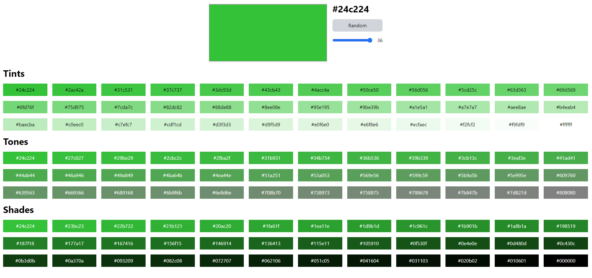

# Color-Shades-Generator

Build a simple color shades generator application



## Tasks

Build a simple color shades generator application (https://gradients.app/en/shades/06979d)

- Put a slider control to set value of shades from 3-36
- Should be able to generate random color by clicking "Random" button
- Should display the correct color HEX values for all the shades, tints and tones
- Should be able to pick up any color by clicking the main rendered result
- Should display the current color as HEX value

## Environment

- Windows 11
- Node v20.15.1
- Npm 10.7.4

## Tech stacks

- Vite + React + Typescript
- Express
- Tailwind CSS
- Chroma-js

## Steps to run program

1. Install node modules

   ```shell
   npm install
   ```

2. Run project
   ```shell
   npm run dev
   ```
   This will host the project on http://localhost:5173.
